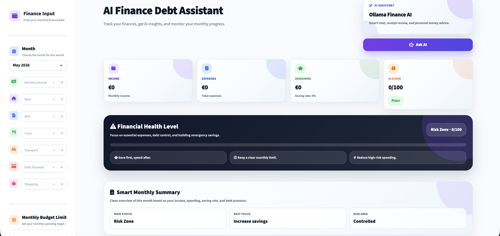
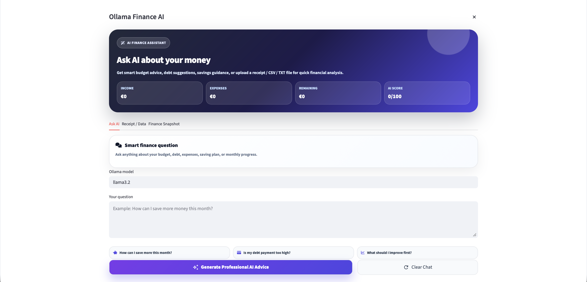
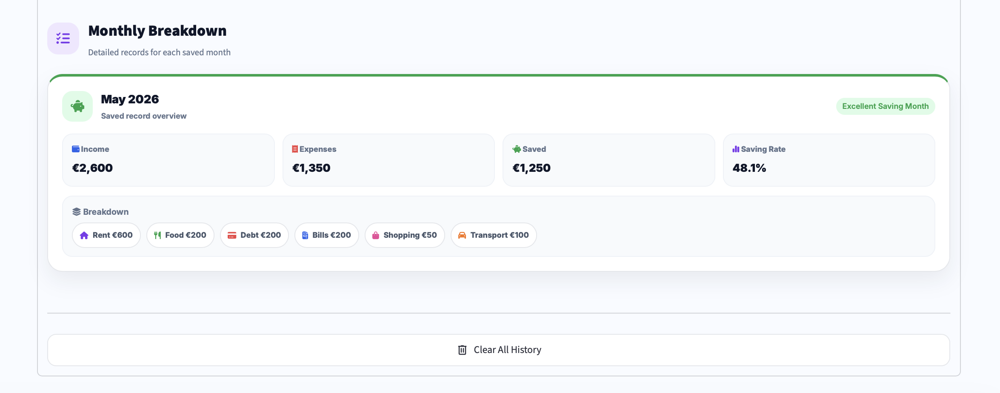
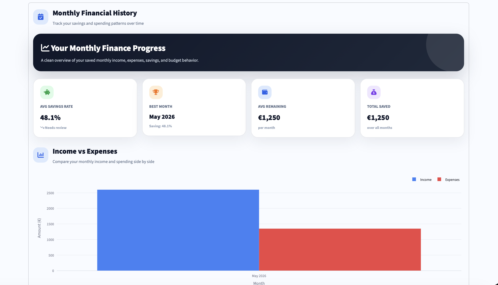
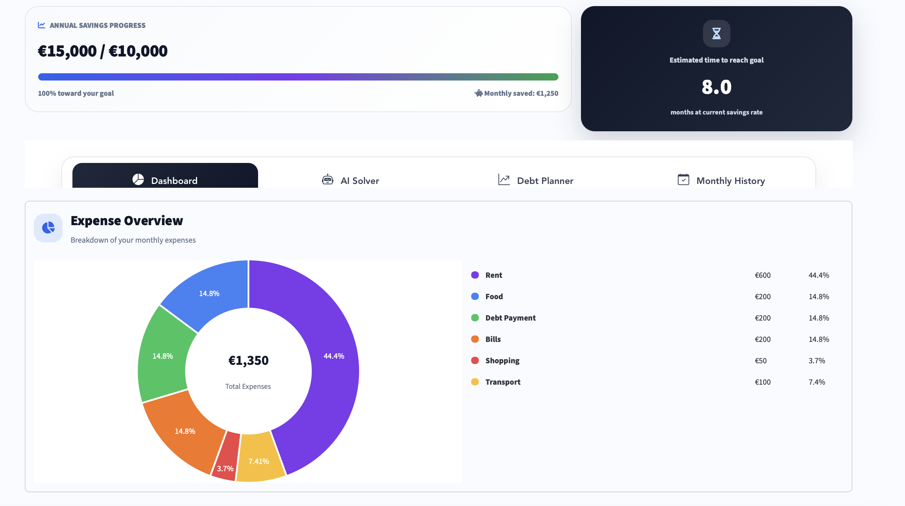
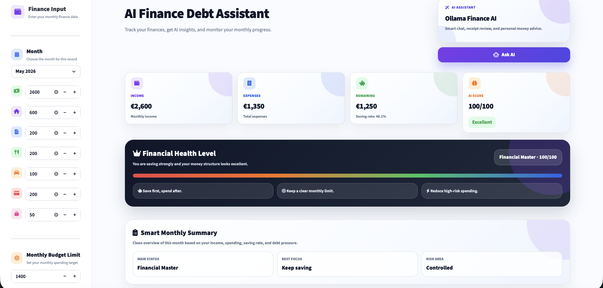

# AI Finance Debt Assistant 

AI Finance Debt Assistant is a modern AI-powered financial management dashboard designed to help users track income, expenses, savings and debt in a smart and interactive way. The application combines modern SaaS-style UI design with AI-powered financial insights, analytics, PDF reporting and local AI chatbot assistance using Ollama.

Modern AI-powered Finance & Debt Management Dashboard built with:

* Streamlit
* Python
* Plotly
* Pandas
* Ollama Local AI
* ReportLab PDF Reports
* Modern SaaS Dashboard UI
* Interactive Analytics
* AI Financial Insights

---

# Features

* Smart Budget Tracking
* Debt Payoff Planner
* Monthly Expense Analysis
* AI Financial Assistant
* AI Finance Chatbot
* Receipt Analysis with AI
* Monthly Financial History
* Animated Finance Charts
* Savings Goal Tracker
* Financial Health Score
* PDF Financial Reports
* Income vs Expense Analytics
* AI Financial Recommendations
* Modern Dashboard UI
* Responsive Design
* Sidebar Finance Inputs
* Beautiful Chart Visualizations
* Local AI with Ollama
* Modern AI Popup Assistant
* Glassmorphism Inspired UI
* Professional SaaS Style Design

---


# Live Demo 

[Open AI Finance Debt Assistant](https://ai-finance-debt-assistant-gxycmo2kjjs7skywrug8mr.streamlit.app)

Modern AI-powered finance dashboard with budgeting, debt planning, PDF reports, and Ollama AI chatbot.

---

# Screenshots 

## Main Dashboard



---

## AI Finance Chatbot



---

## Monthly Financial History



---

## Income vs Expenses Analytics



---

## AI Financial Result



---

## Sample Finance Analysis



---

# Installation Guide (Mac)

## 1. Clone Repository

```bash
git clone https://github.com/baseetnaseri6/AI-Finance-Debt-Assistant.git
```

---

## 2. Open Project

```bash
cd AI-Finance-Debt-Assistant
```

---

## 3. Create Virtual Environment

```bash
python3 -m venv .venv
```

---

## 4. Activate Environment

```bash
source .venv/bin/activate
```

---

## 5. Install Requirements

```bash
pip install -r requirements.txt
```

OR manually:

```bash
pip install streamlit pandas plotly streamlit-option-menu reportlab ollama requests
```

---

## 6. Install Ollama

Download:

https://ollama.com/download/mac

Install model:

```bash
ollama pull llama3
```

---

## 7. Run Application

```bash
streamlit run app.py
```

Application runs on:

```txt
http://localhost:8501
```

---

# Installation Guide (Windows)

## 1. Install Python

Download:

https://python.org

IMPORTANT:

Enable:

```txt
[x] Add Python to PATH
```

---

## 2. Clone Repository

```bash
git clone https://github.com/baseetnaseri6/AI-Finance-Debt-Assistant.git
```

---

## 3. Open Project

```bash
cd AI-Finance-Debt-Assistant
```

---

## 4. Create Virtual Environment

```bash
python -m venv .venv
```

---

## 5. Activate Environment

```bash
.venv\Scripts\activate
```

---

## 6. Install Requirements

```bash
pip install -r requirements.txt
```

OR manually:

```bash
pip install streamlit pandas plotly streamlit-option-menu reportlab ollama requests
```

---

## 7. Install Ollama

Download:

https://ollama.com/download/windows

Install model:

```bash
ollama pull llama3
```

---

## 8. Run Application

```bash
streamlit run app.py
```

---

# Folder Structure 

```txt
AI-Finance-Debt-Assistant
│
├── screenshots
│   ├── main.png
│   ├── chat.png
│   ├── result-1.png
│   ├── sample.png
│   ├── month-history.png
│   └── income-chart.png
│
├── app.py
├── requirements.txt
├── README.md
├── .gitignore
└── reports
```

---

# Future Features 

* AI Spending Prediction
* Voice Finance Assistant
* Smart Subscription Detection
* Multi-user Accounts
* Cloud Database
* Email Reports
* AI Investment Suggestions
* Real-time Currency Converter
* Bank API Integration
* AI Expense Categorization
* Mobile App Version
* Authentication System
* Dark / Light Mode Toggle
* Advanced AI Analytics

---

# Skills Demonstrated 

* Streamlit Dashboard Development
* Python Data Analytics
* Plotly Visualization
* Local AI Integration
* AI Prompt Engineering
* Modern UI/UX Design
* Financial Data Analysis
* PDF Report Generation
* Interactive Charts
* SaaS Dashboard Design
* Responsive Layout Design

---

# Author 

Mohamad Baseet Naseri

* Data Scientist
* AI Engineer
* Full-Stack Developer
* Networking & Automation Enthusiast

Portfolio:
https://naseriai.com

LinkedIn:
https://linkedin.com/in/baseetnaseri6

GitHub:
https://github.com/baseetnaseri6

---

# License 📜

MIT License
